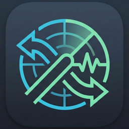
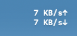
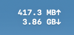
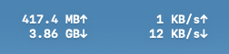
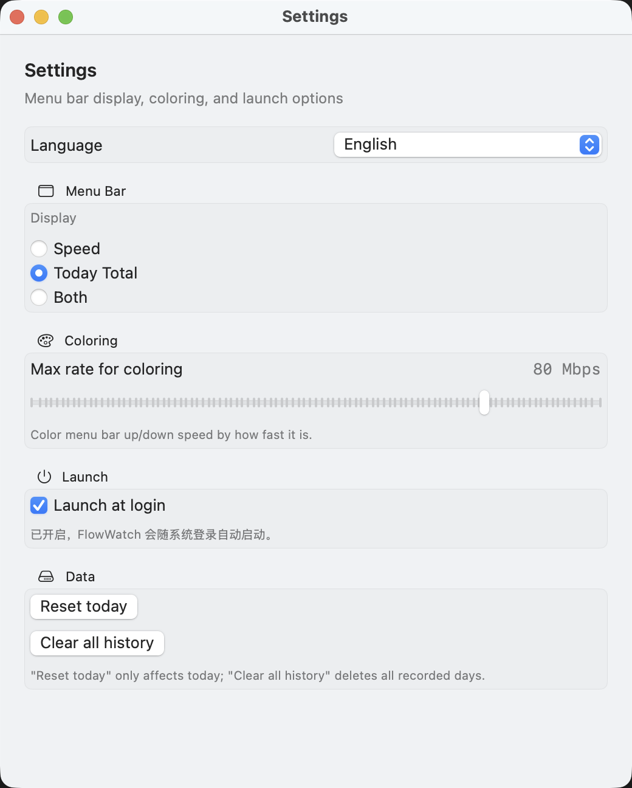
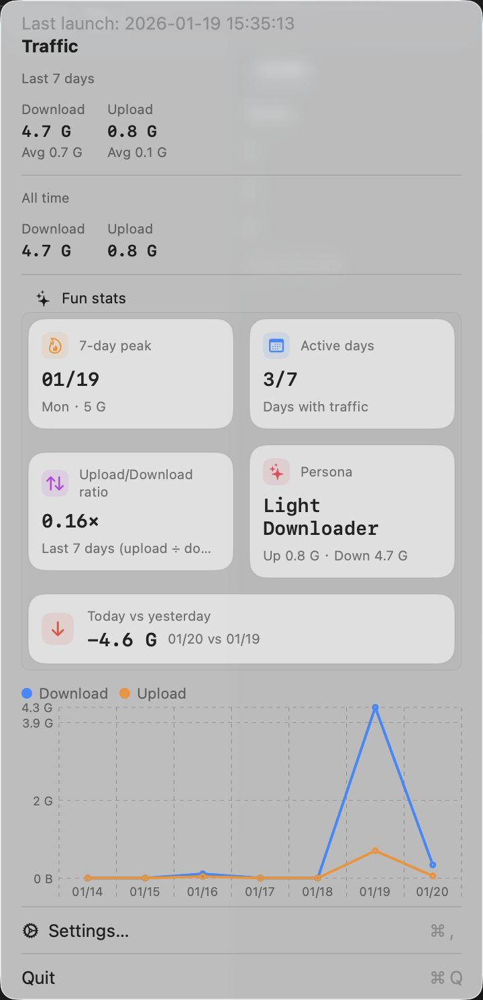

<div align="center">
  
  <h1>FlowWatch</h1>
  <p>Lightweight macOS menu bar network monitor: live speed, traffic stats, and trends.</p>
</div>

[简体中文](README.md) | English

## Features
- Real-time upload/download speed in the menu bar
- Today/total traffic stats and charts (Charts, macOS 13+)
- Custom sampling interval and display style

## Data & Privacy
- Traffic stats are calculated locally from system network interface counters; no packet content is captured.
- Settings and daily totals are stored on your device only (UserDefaults).
- No account is required, and the app does not upload or sync your data.

## Install
```bash
brew tap huangxida/flowwatch
brew install --cask flowwatch
```

## Screenshots
| Status bar: speed | Status bar: today | Status bar: speed + today |
| --- | --- | --- |
|  |  |  |

| Settings | Popup |
| --- | --- |
|  |  |
