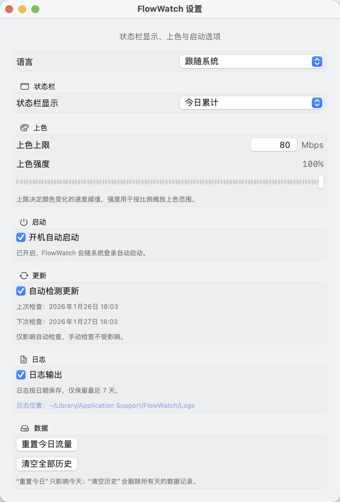
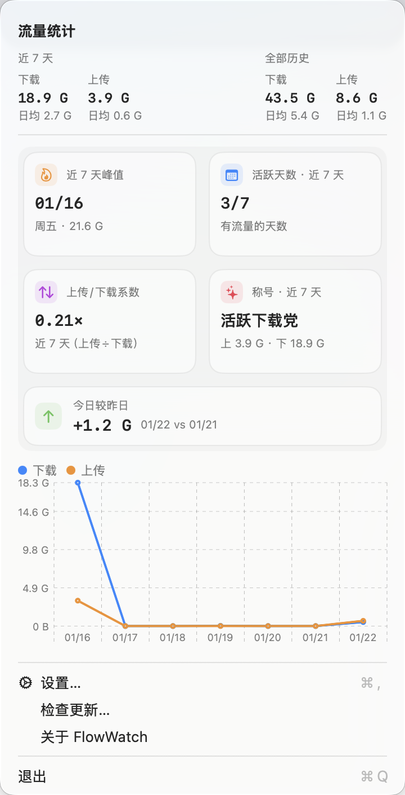

<div align="center">
  
  <h1>FlowWatch</h1>
  <p>轻量级 macOS 菜单栏网速监控工具：实时速率、流量统计与趋势图。</p>
</div>

## 功能
- 菜单栏实时显示上行/下行速率
- 今日/累计流量统计与趋势图（Charts，macOS 13+）
- 自定义采样间隔与显示样式

## 安装
```bash
brew tap huangxida/flowwatch
brew install --cask flowwatch
```


## 截图
| 状态栏：速率 | 状态栏：今日统计 | 状态栏：速率 + 今日统计 |
| --- | --- | --- |
|  |  |  |

| 设置 | 弹窗 |
| --- | --- |
|  |  |
